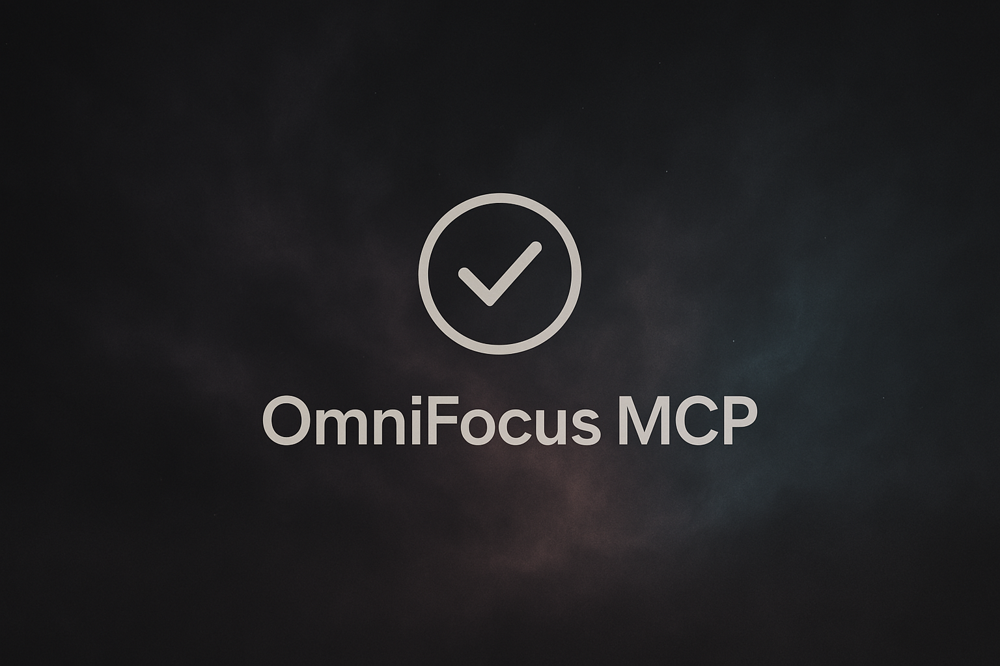

# OmniFocus MCP Server

A Model Context Protocol (MCP) server that integrates with OmniFocus to enable Claude (or other MCP-compatible AI assistants) to interact with your tasks and projects.



## 🌟 Overview

This MCP server creates a bridge between AI assistants (like Claude) and your OmniFocus task management system. It gives AI models the ability to view, create, edit, and remove tasks and projects in your OmniFocus database through natural language conversations.
Some ways you could use it: 

- Translate the PDF of a syllabus into a fully specificed project with tasks, tags, defer dates, and due dates.
- Turn a meeting transcript into a list of actions
- Create visualizations of your tasks, projects, and tags
- Process multiple tasks or projects in a single operation
- Bulk manage your OmniFocus items efficiently


## 🚀 Quick Start

### Prerequisites
- macOS with OmniFocus installed
- Claude Desktop app

### Installation

1. Open Claude Desktop's configuration file:
   - Location: `~/Library/Application Support/Claude/claude_desktop_config.json`
   - You can open it with: `open -e ~/Library/Application\ Support/Claude/claude_desktop_config.json`

2. Add the OmniFocus MCP server to the configuration:
```json
{
  "mcpServers": {
    "omnifocus": {
      "command": "npx",
      "args": ["-y", "omnifocus-mcp"]
    }
  }
}
```

> **Note**: If you already have other MCP servers configured, add the "omnifocus" entry to your existing "mcpServers" object.

3. Save the file and restart Claude Desktop

4. Verify the connection:
   - In Claude, you should see OmniFocus tools available
   - Try asking: "Can you see my OmniFocus tasks?"

### First-Time Setup

When you first use the OmniFocus MCP server:

1. **macOS will prompt for permissions**: You'll need to grant AppleScript access to OmniFocus
2. **Initial data load**: The first `dump_database` operation may take a moment for large databases
3. **Test the connection**: Ask Claude to show you a summary of your tasks to ensure everything is working

## 🌈 Use Cases

### Create Nested Task Structures

> "Create a 'Supermarket Shopping' task with these items as subtasks: Buy milk, Buy bread, Buy eggs, Buy vegetables."

The MCP server now supports nested tasks, allowing you to create hierarchical task structures that match OmniFocus's native capabilities.

### Find and Reference Tasks by ID

> "Show me the details of the task 'Review quarterly report'"
> "Create a subtask under task ID iKNpsVubKhG"

With ID visibility in `dump_database` and the new `get_task_details` tool, you can now:
- See task IDs directly in the database dump
- Look up any task by name to get its ID
- Use exact IDs for reliable parent-child relationships
- Avoid ambiguity when multiple tasks have similar names

### Reorganize your projects, tasks, and tags
> "I want every task to have an energy level tag. show me a list of all the tasks that don't have an energy level tag and your suggestions for what tag to add. I'll make any changes I think are appropriate. Then make the changes in OmniFocus."


### Add tasks from any conversation

> "Ok, thanks for the detailed explanation of why the rule of law is important. Add a recurring task to my activism project that reminds me to call my representative weekly. Include a summary of this conversation in the notes field."

### Quick, Virtual Perspectives

Get a summary of your current tasks and manage them conversationally:

> "Show me all my flagged tasks due this week that don't mention "fish". 

### Process Transcripts or PDFs

Extract action items from meeting transcripts, academic research articles, or notes:

> "I'm pasting in the transcript from today's product meeting. Please analyze it and create tasks in OmniFocus for any action items assigned to me. Put them in my 'Product Development' project."

### Batch Operations

Manage multiple items efficiently:

> "I have a list of 20 tasks from this meeting transcript. Please add them all to my 'Q2 Planning' project with appropriate tags and due dates."


## 🔧 Available Tools

The server currently provides these tools:

### `dump_database`
Gets the current state of your OmniFocus database. Now includes task and project IDs in the output for easy reference when creating nested tasks or relationships.

### `get_task_details`
Get detailed information about a specific task by ID or name.

Parameters:
- `taskId`: (Optional) The ID of the task to get details for
- `taskName`: (Optional) The name of the task to get details for (partial match supported)

This tool provides comprehensive task information including:
- Full task properties (status, dates, flags, etc.)
- Parent/child relationships with IDs
- Project association
- All associated tags
- Complete metadata

### `add_omnifocus_task`
Add a new task to OmniFocus.

Parameters:
- `name`: The name of the task
- `projectName`: (Optional) The name of the project to add the task to
- `parentTaskId`: (Optional) The ID of the parent task to nest this task under
- `parentTaskName`: (Optional) The name of the parent task to nest this task under
- `note`: (Optional) Additional notes for the task
- `dueDate`: (Optional) The due date of the task in ISO format
- `deferDate`: (Optional) The defer date of the task in ISO format
- `flagged`: (Optional) Whether the task is flagged or not
- `estimatedMinutes`: (Optional) Estimated time to complete the task
- `tags`: (Optional) Tags to assign to the task

Example - Creating nested tasks:
```
// Create parent task
add_omnifocus_task({
  name: "Supermarket Shopping",
  dueDate: "2024-01-15"
})

// Create subtasks
add_omnifocus_task({
  name: "Buy milk",
  parentTaskName: "Supermarket Shopping"
})

add_omnifocus_task({
  name: "Buy bread",
  parentTaskName: "Supermarket Shopping"
})
```

### `add_project`
Add a new project to OmniFocus.

Parameters:
- `name`: The name of the project
- `folderName`: (Optional) The name of the folder to add the project to
- `note`: (Optional) Additional notes for the project
- `dueDate`: (Optional) The due date of the project in ISO format
- `deferDate`: (Optional) The defer date of the project in ISO format
- `flagged`: (Optional) Whether the project is flagged or not
- `estimatedMinutes`: (Optional) Estimated time to complete the project
- `tags`: (Optional) Tags to assign to the project
- `sequential`: (Optional) Whether tasks in the project should be sequential

### `remove_item`
Remove a task or project from OmniFocus.

Parameters:
- `id`: (Optional) The ID of the task or project to remove
- `name`: (Optional) The name of the task or project to remove
- `itemType`: The type of item to remove ('task' or 'project')

### `edit_item`
Edit a task or project in OmniFocus.

Parameters:
- `id`: (Optional) The ID of the task or project to edit
- `name`: (Optional) The name of the task or project to edit
- `itemType`: The type of item to edit ('task' or 'project')
- Various parameters for editing properties

### `batch_add_items`
Add multiple tasks or projects to OmniFocus in a single operation.

Parameters:
- `items`: Array of items to add, where each item can be:
  - `type`: The type of item ('task' or 'project')
  - `name`: The name of the item
  - `note`: (Optional) Additional notes
  - `dueDate`: (Optional) Due date in ISO format
  - `deferDate`: (Optional) Defer date in ISO format
  - `flagged`: (Optional) Whether the item is flagged
  - `estimatedMinutes`: (Optional) Estimated completion time
  - `tags`: (Optional) Array of tags
  - `projectName`: (Optional) For tasks: the project to add to
  - `parentTaskId`: (Optional) For tasks: parent task ID for nesting
  - `parentTaskName`: (Optional) For tasks: parent task name for nesting
  - `folderName`: (Optional) For projects: the folder to add to
  - `sequential`: (Optional) For projects: whether tasks are sequential

### `batch_remove_items`
Remove multiple tasks or projects from OmniFocus in a single operation.

Parameters:
- `items`: Array of items to remove, where each item can be:
  - `id`: (Optional) The ID of the item to remove
  - `name`: (Optional) The name of the item to remove
  - `itemType`: The type of item ('task' or 'project')

## 🛠 Development

### Local Development Setup

1. Clone the repository:
```bash
git clone https://github.com/themotionmachine/omnifocus-mcp-server.git
cd omnifocus-mcp-server
```

2. Install dependencies and build:
```bash
npm install
npm run build
```

3. Run the server locally:
```bash
npm start
# Or use the CLI wrapper:
node cli.cjs
```

#### Manual Testing via Terminal

You can also send individual MCP function calls directly from the terminal to exercise the server without Claude. The server reads and writes MCP JSON messages on standard input/output. For example, to add a new task.

##### Bash / Zsh

```bash
# In one terminal, start the server:
node cli.cjs

# In another terminal, send a function call payload:
payload=$(jq -nc \
  --arg name       "Buy bread" \
  --arg dueDate    "2025-08-28 15:00" \
  --arg project    "Home" \
  --argjson tags   '["Me","1"]' \
  '{type:"function_call",
    name:"add_omnifocus_task",
    arguments:{
      name:$name,
      dueDate:$dueDate,
      projectName:$project,
      tags:$tags
    }
  }')

printf 'Content-Length: %d\r\n\r\n%s' \
  "${#payload}" \
  "$payload" \
| node cli.cjs
```

##### Fish

```fish
# In one terminal, start the server:
node cli.cjs

# In another terminal, build the payload:
set payload (jq -nc \
  --arg name       "Buy bread" \
  --arg dueDate    "2025-08-28 15:00" \
  --arg project    "Home" \
  --argjson tags   '["Me","1"]' \
  '{type:"function_call",
    name:"add_omnifocus_task",
    arguments:{
      name:$name,
      dueDate:$dueDate,
      projectName:$project,
      tags:$tags
    }
  }')
# Compute the byte length of the payload:
set len (printf '%s' $payload | wc -c)

# Use double quotes so fish expands the CR/LF escapes correctly:
printf "Content-Length: %d\r\n\r\n%s" $len $payload | node cli.cjs
```
> **Note**: Make sure to include the correct MCP protocol framing (e.g. headers) if your client requires it. You can use tools like `jq -c` to compact and prepare the JSON payload.

##### Long‑running server via bi‑directional FIFOs

For a truly long‑running server where you can send *and* receive MCP messages via files, use two named pipes (one for stdin, one for stdout). This captures the server’s responses in a separate pipe.

```bash
# Create the FIFOs (once):
mkfifo /tmp/mcp.in /tmp/mcp.out

# Launch the server reading from /tmp/mcp.in and writing to /tmp/mcp.out:
node cli.cjs < /tmp/mcp.in > /tmp/mcp.out 2>&1 &

# In another shell, tail the server’s responses:
tail -f /tmp/mcp.out &

# In yet another shell, send requests:
payload=…  # build your function_call JSON as before
printf 'Content-Length: %d\r\n\r\n%s' "${#payload}" "$payload" > /tmp/mcp.in
```

```fish
# Create the FIFOs (once):
mkfifo /tmp/mcp.in /tmp/mcp.out

# Launch the server reading from /tmp/mcp.in and writing to /tmp/mcp.out:
node cli.cjs < /tmp/mcp.in > /tmp/mcp.out 2>&1 &

# In another shell, tail the server’s responses:
tail -f /tmp/mcp.out &

# Send requests (reuse $payload and $len):
printf "Content-Length: %d\r\n\r\n%s" $len $payload > /tmp/mcp.in
```

This setup lets you keep the server live and view each JSON‑RPC response in `/tmp/mcp.out` while issuing calls to `/tmp/mcp.in`.

##### Bash coprocess (bash‑only)

Bash’s `coproc` can also manage a long‑running stdin/stdout server:

```bash
coproc MCP_SERVER { node cli.cjs; }

# Send a framed payload:
printf 'Content-Length: %d\r\n\r\n%s' "${#payload}" "$payload" >&"${MCP_SERVER[1]}"

# Read the response:
read -r RESPONSE <&"${MCP_SERVER[0]}"
echo "Server response: $RESPONSE"
```

### Using Your Local Version in Claude Desktop

To use your local development version instead of the npm package:

1. Update your Claude Desktop config to point to your local installation:
```json
{
  "mcpServers": {
    "omnifocus": {
      "command": "node",
      "args": ["/absolute/path/to/omnifocus-mcp-server/cli.cjs"]
    }
  }
}
```

2. Restart Claude Desktop to use your local version

### Development Commands

```bash
npm run build    # Build TypeScript and copy AppleScript files
npm run dev      # Watch mode for TypeScript compilation
npm start        # Run the built server

### Debugging the server

You can run the server under Node’s debugger or enable breakpoints at startup:

```bash
# Debug the CLI wrapper with the Inspector:
node --inspect-brk cli.cjs

# Or debug the compiled server directly:
node --inspect-brk dist/server.js
```

After launching with `--inspect` or `--inspect-brk`, attach your editor or Chrome Inspector (`chrome://inspect`) to set breakpoints, step through code, and inspect variables.
```

### Architecture

- **TypeScript**: Source code in `src/`
- **MCP SDK**: Uses Model Context Protocol for AI integration
- **AppleScript/JXA**: Native OmniFocus interaction via `src/utils/omnifocusScripts/`
- **Tool System**: Modular tools in `src/tools/` with definitions and primitives

## 🧠 How It Works

This server uses AppleScript to communicate with OmniFocus, allowing it to interact with the application's native functionality. The server is built using the Model Context Protocol SDK, which provides a standardized way for AI models to interact with external tools and systems.

## 📜 License

MIT

## 🤝 Contributing

Contributions are welcome! Please feel free to submit a Pull Request.
